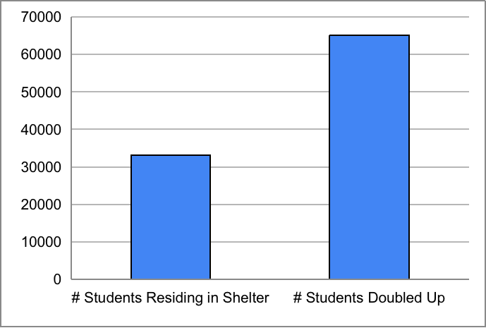
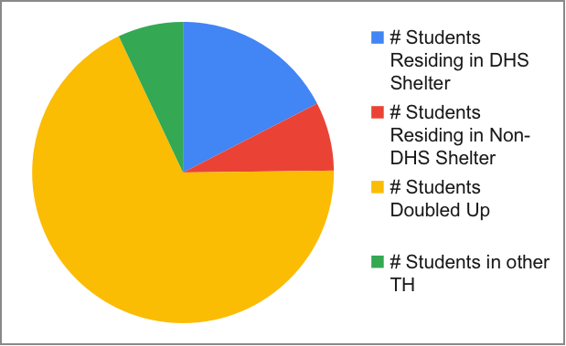

## Data set details

My data set is school-level data on the enrollment of students in temporary housing in New York City from 2018 to 2019. It comes from [NYC OpenData](https://data.cityofnewyork.us/Education/2018-2019-Students-in-Temporary-Housing-School-Lev/8iee-pzu6). The original data file was in CSV format. Some of the raw data look like:

| DBN    | School Name                           | # Total Students | # Students in Temporary Housing | % Students in Temporary Housing | # Students Residing in Shelter | # Residing in DHS Shelter | # Residing in Non-DHS Shelter | # Doubled Up |
| ------ | ------------------------------------- | ---------------- | ------------------------------- | ------------------------------- | ------------------------------ | ------------------------- | ----------------------------- | ------------ |
| 01M015 | P.S. 015 Roberto Clemente             | 187              | 67                              | 0.36                            | 16                             | 6                         | 10                            | 49           |
| 01M019 | P.S. 019 Asher Levy                   | 274              | 34                              | 0.12                            | 19                             | s                         | s                             | 15           |
| 01M020 | P.S. 020 Anna Silver                  | 512              | 95                              | 0.19                            | 41                             | 26                        | 15                            | 51           |
| 01M034 | P.S. 034 Franklin D. Roosevelt        | 348              | 84                              | 0.24                            | 46                             | 34                        | 12                            | 38           |
| 01M063 | The STAR Academy - P.S.63             | 212              | 52                              | 0.25                            | 13                             | s                         | s                             | 37           |
| 01M064 | P.S. 064 Robert Simon                 | 256              | 46                              | 0.18                            | 18                             | s                         | s                             | 25           |
| 01M110 | P.S. 110 Florence Nightingale         | 394              | 52                              | 0.13                            | 14                             | s                         | s                             | 37           |
| 01M134 | P.S. 134 Henrietta Szold              | 318              | 50                              | 0.16                            | 31                             | 24                        | 7                             | 17           |
| 01M140 | P.S. 140 Nathan Straus                | 394              | 72                              | 0.18                            | 23                             | 17                        | 6                             | 48           |
| 01M142 | P.S. 142 Amalia Castro                | 357              | 96                              | 0.27                            | 30                             | s                         | s                             | 62           |
| 01M184 | P.S. 184m Shuang Wen                  | 693              | 78                              | 0.11                            | s                              | s                         | s                             | 74           |
| 01M188 | P.S. 188 The Island School            | 462              | 185                             | 0.40                            | 124                            | 104                       | 20                            | 58           |
| 01M292 | Orchard Collegiate Academy            | 165              | 24                              | 0.15                            | 9                              | s                         | s                             | 12           |
| 01M301 | Technology, Arts, and Sciences Studio | 99               | 15                              | 0.15                            | 8                              | s                         | s                             | 6            |
| 01M315 | The East Village Community School     | 332              | 14                              | 0.04                            | 8                              | s                         | s                             | 6            |
| 01M332 | University Neighborhood Middle School | 209              | 30                              | 0.14                            | 10                             | s                         | s                             | 18           |
| 01M361 | The Children's Workshop School        | 323              | 30                              | 0.09                            | 13                             | s                         | s                             | 14           |
| 01M363 | Neighborhood School                   | 310              | 26                              | 0.08                            | s                              | s                         | s                             | 23           |
| 01M364 | Earth School                          | 363              | 51                              | 0.14                            | 12                             | s                         | s                             | 38           |
             
When I scrubbed the data, the first problem was that there were a lot of missing data shown as "s". They were presented as "s" because they were suppressed data of 5 or fewer students. Because they are negligibly small, I changed them to 0 for the convenience of subsequent calculations.

And then, since the data file has nothing to modify except missing data, I wanted to add or delete a column of data. After careful observation, I found that the total number of students in temporary housing in each school is always greater than the sum of the subsequent classified data. Then I checked the [categories of temporary housing](https://www.schools.nyc.gov/school-life/special-situations/students-in-temporary-housing) on the Internet, and found that besides the shelter and doubled up listed in the file, there are many other categories, such as the car and public place. Therefore, I guessed that the gap should be the data of students in other kinds of temporary housing, and I added a field of "Others". To add the column, I separated the header and data like this:

```
header = f1.readline().strip()  
header += ',# Others'  

reader = csv.reader(f1)
```

At last, in the process of writing these data to a new CSV file, I used the function ",".join(), but since there are commas in the school name, the school name would be separated into different columns, which was really problematic. To solve this problem, I searched on the Internet and found that the csv.writer object automatically escapes the comma by enclosing the data item in double quotes. Since those school names with commas were already enclosed in double quotes in the original data file, I just wrote the code in the following way:

```
for row in rows:  
    writer = csv.writer(f2)  
    writer.writerow(row)  
```

Links to my data files:
[The Original Data](data/temporaryhousing1819.csv); 
[The Munged Data](data/clean_data.csv);
[The Spreadsheet File](data/clean_data.xlsx)  


## Analysis

I have calculated the following aggregate statistic:

Total Schools: 1720  
Total Students: 1063856  
Total Students in Temporary Housing: 104987  
Average Students in Temporary Housing: 61.07  
Median of Students in Temporary Housing: 46  

Through this set of statistics, we can find 2 phenomena:

1. There were about one-tenth of students in NYC in temporary housing from 2018 to 2019, which can be clearly shown by my later calculation of the average percentage of students in temporary housing which equals 0.11, and means that most students (about 90% of them) had their own home.

2. The average number of students in temporary housing is much higher than the median of students in temporary housing, so data on students in temporary housing in all the schools in NYC from 2018 to 2019 is probably in a power-law distribution, meaning that the majority of schools were low in the number of students in temporary housing, and a minority was really high -- the maximum of students in temporary housing was 955.

And then, when I went through the data, I found that some school names are with P.S. but some are not. I searched on the Internet and knew that P.S. is the abbreviation of public school. Therefore, I calculated sets of statistics for both public schools and non-public schools:

Public Schools: 713  
P.S. Students: 460063  
P.S. Students in Temporary Housing: 51854  
Average P.S. Students in Temporary Housing: 72.73  

Non-public Schools: 1007  
Non-P.S. Students: 603793  
Non-P.S. Students in Temporary Housing: 53133  
Average Non-P.S. Students in Temporary Housing: 52.74  

These statistics show that non-public schools were more than public schools, and the corresponding students and students in temporary housing were more in non-public schools, but the average number of students in temporary housing in public schools was 20 greater than that in non-public schools, so if thinking about the statistics relatively, public schools had more students in temporary housing. 



This column chart shows that students doubled up were twice as many as students residing in a shelter, which could mean that the doubled-up was the most normal, comfortable, or convenient temporary housing for students in NYC.



This pie chart shows the percentage of students in each type of temporary housing. The ratio is a bit skewed since the data of each category were suppressed more than the total values, but it is enough to illustrate some facts.

Firstly, we can see that the Department of Homeless Services(DHS) provided more than twice temporary housing compared with Non-DHS, so this illustrates that DHS well covered homeless students in NYC.

Secondly, "Others" has the smallest percentage. Since "Others" represents the worse conditions of homeless students in NYC, its low percentage could mean that most students in NYC had an appropriate place of living.


## Extra-credit

This assignment deserves extra credit because the data set is a large one with 1720 rows.
